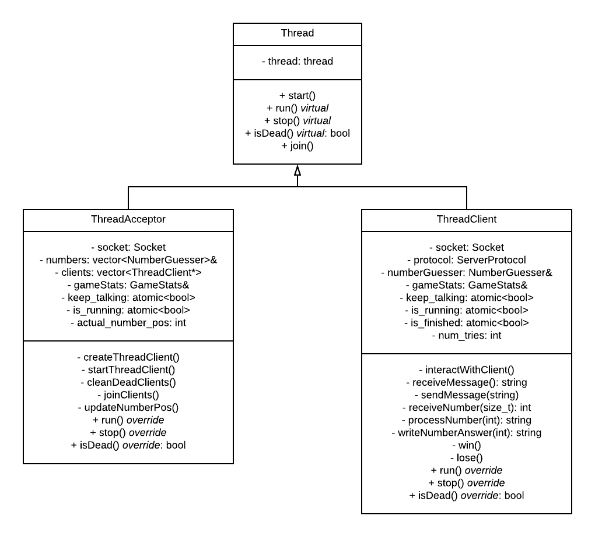
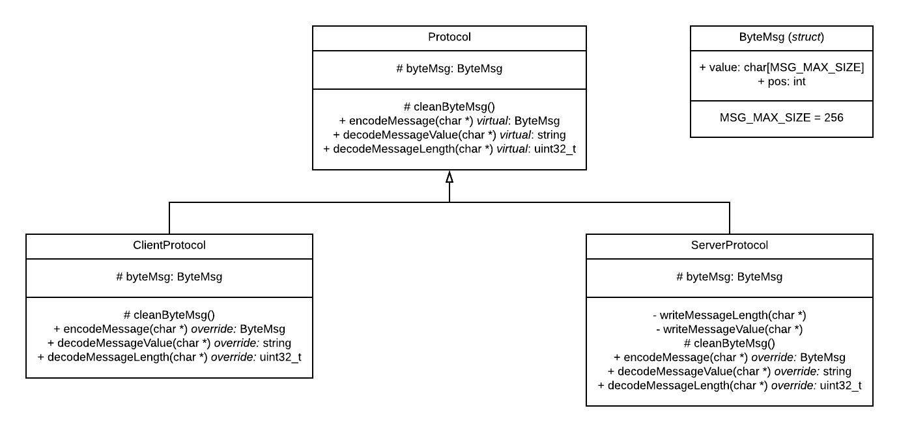

# Nombre: Francisco Hermani

# Padrón: 98223

Link GitHub: https://github.com/franhermani/taller-tp3

# Resolución del TP

### Clase Socket

Esta etapa consistió en la reutilización del TDA Socket implementado en el TP1. Esto implicó
una transformación del código C a C++, y de struct a Class. Tuve que hacer ciertas modificaciones,
principalmente en la visibilidad y valores de retorno de ciertos métodos. Por ejemplo, la función
*accept()* ahora crea el socket internamente y lo devuelve por movimiento, mientras que en C
lo recibía como parámetro y le seteaba el socket descriptor.
A su vez, apliqué RAII en el destructor del socket, para cerrar los canales y el socket descriptor,
en caso de que permanezcan abiertos.

### Constantes del enunciado

Identifiqué los valores constantes propuestos por el enunciado y los definí en los archivos
*common_defines.h* y *server_defines.h*, dependiendo de las entidades que hacen uso de ellos.

### Implementación de la lógica del juego

Procedí a resolver la lógica propiamente dicha del juego, realizando pruebas en un único ejecutable,
contemplando casos borde. Luego, agregué algunas excepciones para atrapar aquellos con dígitos repetidos
o fuera de rango.

### Ejecución cliente - servidor (1 a 1)

Realicé una comunicación del cliente con el servidor con la nueva clase Socket. Esto me llevó a
identificar algunos errores en mis funciones de send y receive. Por ejemplo, estaba cerrando los
canales en momentos que no debía, y no contemplaba el caso de que el cliente cerrar inesperadamente
la conexión.

### Construcción del protocolo

Una vez que la comunicación a través de socket funcionaba correctamente, implementé el protocolo
de envío y recepción de datos. Como se detallará más adelante, decidí crear una clase base
*Protocol*, de la cual heredan *ServerProtocol* y *ClientProtocol* y redefinen sus métodos.

### Servidor multicliente

Finalizado el funcionamiento del TP para un único cliente, comencé la implementación de la
arquitectura multicliente. Para ello, creé dos clases derivadas de thread que serán explicadas
en la próxima sección.

# Refactorización

Como etapa final, inicié un proceso de refactorización que incluyó los siguientes puntos:

- Modularización de funciones
- Mejor asignación de responsabilidades
- Uso de *member initializer lists*
- Uso de *const* en funciones que había pasado por alto
- Liberación de recursos en destructores que había pasado por alto (RAII)
- Corrección en la visibilidad de ciertos métodos

# Puntos de interés

### Arquitectura multicliente

DIAGRAMA

### RAII

Para un adecuado uso de los recursos, con el objetivo de no tener leaks de memoria, apliqué
RAII en diversas clases. A saber:
- *Socket*. Cierra los canales y el socket descriptor en caso de que estén abiertos.
- *Server*. Libera la memoria reservada para el *ThreadAcceptor*.
- *File*. Cierra el archivo en caso de que esté abierto.

### SocketError

Creación de la clase SocketError y uso de ella en la clase Socket. Esta clase hereda de la
excepción estándar de C++ y permite componer un mensaje de error con parámetros variables.
A su vez, setea el valor de *errno* adecuadamente, lo cual resulta muy útil a la hora de manejar
sockets. Todas las funciones de sockets hacen uso de ella, y el hilo principal se encarga de
realizar un *try catch* para atrapar las excepciones que puedan surgir.

### Polimorfismo

Hice uso de la técnica de polimorfismo en las siguientes clases:
- Clase base *Thread* y clases derivadas *ThreadAcceptor* y *ThreadClient*. Ambas clases derivadas
overridean las funciones virtuales de su clase base: *run()*, *stop()* y *isDead()*.

- Clase base *Protocol* y clases derivadas *ServerProtocol* y *ClientProtocol*. Ambas clases derivadas
overridean las funciones virtuales de su clase base: *encodeMessage()*, *decodeMessageValue()* y
*decodeMessageLength()*.

### Sobrecarga del operador ()

El operador () se sobrecargó en el método de la clase *NumberGuesser* encargado de procesar un
número y comparar sus dígitos con el número secreto.

# Aclaraciones

- El servidor lee el archivo de números completo y lo valida antes de
  comenzar a escuchar por conexiones entrantes de clientes.
  
- Se realiza una eliminación de clientes desconectados de forma controlada mediante el método
  *cleanDeadClients()* de la clase *ThreadAcceptor*. Esta función es llamada cada vez que se
  acepta un nuevo cliente.
  
- Si un cliente finaliza su ejecución inesperadamente (por ejemplo, presionando Ctrl+C por
  la consola) el socket del servidor detecta esto, aborta la ejecución del cliente
  y no se contabiliza como una derrota.
  
- El servidor finaliza su ejecución de forma polite. Es decir, cuando recibe el carácter 'q',
  cierra el socket aceptador y espera a que finalicen su partida los clientes activos.